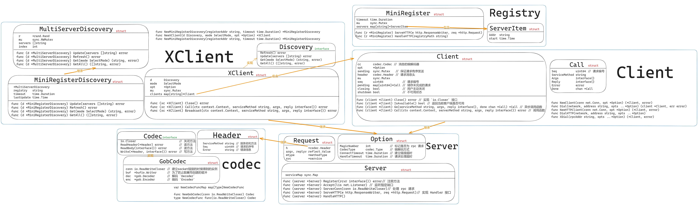

# minirpc
## 1 项目结构图

## 2 消息编解码
```go
// GobCodec
type GobCodec struct {
	conn io.ReadWriteCloser // 建立socket链接的时候得到的实例
	buf  *bufio.Writer      // 为了防止阻塞而创建的缓冲 `Writer`
	dec  *gob.Decoder       // 解码 `Decoder`
	enc  *gob.Encoder       // 编码 `Encoder`
}

// ReadHeader 读取 `Header` 信息, 使用 dec 进行对 `Header` 进行解码即可
func (c *GobCodec) ReadHeader(h *Header) error {
	return c.dec.Decode(h)
}

// ReadBody 读取 `Body` 信息, 与 ReadHeader() 类似
func (c *GobCodec) ReadBody(body interface{}) error {
	return c.dec.Decode(body)
}

// Write 写回相应的函数
func (c *GobCodec) Write(h *Header, body interface{}) (err error) {
	defer func() {
		_ = c.buf.Flush() // 将缓冲区的数据写回 io.Writer 中
		if err != nil {
			_ = c.Close() // 关闭缓冲区, 释放对应的资源
		}
	}()
	// 对 `Header` 和 `Body` 信息进行编码
	if err := c.enc.Encode(h); err != nil {
		log.Println("rpc codec: gob error encoding header: ", err)
		return err
	}
	if err := c.enc.Encode(body); err != nil {
		log.Panicln("rpc codec: gob error encoding body:", err)
		return nil
	}
	return nil
}
func (c *GobCodec) Close() error {
	return c.conn.Close()
}
```
消息的读取和返回借助了 `encoding/gob` 和 `io` 包实现, 编解码使用 "encoding/gob" 标准库中的函数, 返回则是将数据写入 `io.Writer`, 关闭缓冲区即为写入完毕
## 3 服务端
### 3.1 定义传输方式
```
| Option{MagicNumber: xxx, CodecType: xxx} | Header{ServiceMethod ...} | Body interface{} |
| <------      固定 JSON 编码      ------>  | <-------   编码方式由 CodeType 决定   ------->|
传输实例:
| Option | Header1 | Body1 | Header2 | Body2 | ...
```
为了简化程序, 建立链接后会传入一个 `Option` 来规定之后的编码格式和其他一些配置, 后面的数据再进行一些 `Header`, `Body` 的方式进行传输
### 3.2 配置 `Option`
```go
// Option 固定 JSON 编码, 用于定义之后的传输编码方式
type Option struct {
	MagicNumber    int           // 标记是否为 rpc 请求
	CodecType      codec.Type    // 编解码方式
	ConnectTimeout time.Duration // 建立链接超时
	HandleTimeout  time.Duration // 请求处理超时
}
```
### 3.3 服务端 `Server`
```go
type Server struct {
	serviceMap sync.Map
}
```
`Server` 有五个公开的方法:
```go
func (server *Server) Register(rcvr interface{}) error// 注册
func (server *Server) Accept(lis net.Listener) // 监听指定端口
func (server *Server) ServerConn(conn io.ReadWriteCloser)// 处理 rpc 请求
func (server *Server) ServeHTTP(w http.ResponseWriter, req *http.Request)// 实现 Handler 接口
func (server *Server) HandleHTTP()
```
#### 3.3.1 `Register` 
`Register` 负责创建一个新的 `Server`, 并将其加入维护的并发 `Map` 中:
```go
func (server *Server) Register(rcvr interface{}) error {
	s := newService(rcvr)
	if _, dup := server.serviceMap.LoadOrStore(s.name, s); dup {
		return errors.New("rpc: service already defined: " + s.name)
	}
	return nil
}
```
#### 3.3.2 `Accept`
```go
// Accept 接受一个 `lis` 监听端口
func (server *Server) Accept(lis net.Listener) {
	for {
		conn, err := lis.Accept()
		if err != nil {
			log.Println("rpc server: accept error:", err)
			return
		}
		go server.ServerConn(conn)
	}
}
```
#### 3.3.3 `ServerConn`

#### 3.3.4 `ServerHTTP`
```go
// ServeHTTP 实现了一个 http.Handler，用于响应 RPC 请求
func (server *Server) ServeHTTP(w http.ResponseWriter, req *http.Request) {
	// minirpc http请求响应不需要很大的拓展性, rpc通信开始的时候执行, 只需要支持 "CONNECT" 即可
	if req.Method != "CONNECT" {
		// 向响应的头部加入指定的字符串
		w.Header().Set("Connect-Type", "text/plain; charset=utf-8")
		w.WriteHeader(http.StatusMethodNotAllowed)
		_, _ = io.WriteString(w, "405 must CONNECT\n")
		return
	}
	// Hijack 允许调用者接管连接
	conn, _, err := w.(http.Hijacker).Hijack()
	if err != nil {
		log.Print("rpc hijacking", req.RemoteAddr, ": ", err.Error())
		return
	}
	// 写入信息
	_, _ = io.WriteString(conn, "HTTP/1.0 "+connected+"\n\n")
	server.ServerConn(conn)
}
```
#### 3.3.5 `HandleHTTP`
```go
// HandleHTTP 为 rpcPath 上的 RPC 消息注册 HTTP 处理程序
func (server *Server) HandleHTTP() {
	http.Handle(defaultPRCPath, server)
	http.Handle(defaultDebugPath, debugHTTP{server})
	log.Println("rpc server debug path:", defaultDebugPath)
}
```
## 4 客户端
### 4.1 `Call` 调用格式的确认
```go
type Call struct {
	Seq           uint64 // 请求编号
	ServiceMethod string// 请求方法
	Args          interface{}// 入参
	Reply         interface{}// 出参
	Error         error// 错误
	Done          chan *Call// 异步调用
}

// done Done 的类型是 chan *Call, 当调用结束时, 会调用 call.done() 通知调用方
func (call *Call) done() {
call.Done <- call
}
```
### 4.2 `Client` 的实现
```go
// Client 客户端结构体
type Client struct {
	cc       codec.Codec // 消息的编解码器
	opt      *Option
	sending  sync.Mutex   // 保证请求有序发送
	header   codec.Header // 请求消息头
	mu       sync.Mutex
	seq      uint64           // 请求编号
	pending  map[uint64]*Call // 储存未完成的请求
	closing  bool             // 用户主动关闭
	shutdown bool             // 发生错误关闭, 都代表 `Client` 处于不可用状态
}

```
`Client` 实现了四个公开方法
```go
func (client *Client) Close() error // 实现 `io.Closer` 接口
func (client *Client) IsAvailable() bool // 返回当前客户端是否可用
func (client *Client) Go(serviceMethod string, args, reply interface{}, done chan *Call) *Call // 异步调用函数
func (client *Client) Call(ctx context.Context, serverMethod string, args, reply interface{}) error // 调用函数
```
#### 4.2.1 `Close` 
```go
// Close 实现 `io.Closer` 接口
func (client *Client) Close() error {
	client.mu.Lock()
	defer client.mu.Unlock()
	// 客户端已经被主动关闭, 返回自定义错误
	if client.closing {
		return ErrShutdown
	}
	// 服务端还被主动关闭, 则将其置为关闭状态
	client.closing = true
	// 关闭链接
	return client.cc.Close()
}
```
#### 4.2.2 `IsAvailable`
```go
// IsAvailable 返回当前客户端是否可用
func (client *Client) IsAvailable() bool {
	client.mu.Lock()
	defer client.mu.Unlock()
	// 两个状态都没有被置为关闭方可返回 `true`
	return !client.shutdown && !client.closing
}

```
#### 4.2.3 `Go`

#### 4.2.4 `Call`
```go
// Call 调用指定函数, 并等待其返回, 返回它的错误
func (client *Client) Call(ctx context.Context, serverMethod string, args, reply interface{}) error {
	// Go 的目的是调用函数
	call := client.Go(serverMethod, args, reply, make(chan *Call, 1))
	// 通过context进行超时控制
	select {
	case <-ctx.Done():
		client.removeCall(call.Seq)
		return errors.New("rpc client: call failed: " + ctx.Err().Error())
	case call := <-call.Done:
		return call.Error
	}
}
```
## 5 负载均衡
**服务注册与发现的接口**
`Discovery` 接口必须包含是四个方法:
```go
type Discovery interface {
	Refresh() error// 刷新
	Update(servers []string) error// 更新
	Get(mode SelectMode) (string, error)// 获得服务
	GetAll() ([]string, error)// 获得服务列表
}
```
有两个结构体实现了这个接口, 分别是服务发现的结构体 `MultiServerDiscovery` 和 服务注册的结构体 `MiniRegisterDiscovery`:
### 5.1 服务发现与负载均衡
```go
type MultiServerDiscovery struct {
	r       *rand.Rand
	mu      sync.RWMutex
	servers []string
	index   int
}
```
采用的负载均衡策略是轮流依次获取实例
### 5.2 支持负载均衡的客户端
```go
type XClient struct {
	d       Discovery
	mode    SelectMode
	opt     *Option
	mu      sync.Mutex
	clients map[string]*Client
}
```
`XClient` 维护了一个客户端的 `Map`
#### 5.2.1 `Call`
通过负载均衡选择一个去处
```go
func (xc *XClient) call(rpcAddr string, ctx context.Context, serviceMethod string, args, reply interface{}) error {
	// 进行连接
	client, err := xc.dial(rpcAddr)
	if err != nil {
		return err
	}
	return client.Call(ctx, serviceMethod, args, reply)
}
func (xc *XClient) Call(ctx context.Context, serviceMethod string, args, reply interface{}) error {
	// 通过负载均衡选择一个去处, 获得他的 `rpcAddr`
	rpcAddr, err := xc.d.Get(xc.mode)
	if err != nil {
		return err
	}
	// 调用 call
	return xc.call(rpcAddr, ctx, serviceMethod, args, reply)
}
```
#### 5.2.2 `Broadcast`
```go
// Broadcast 将请求广播到所有服务实例
// 1. 请求是并发的
// 2. 需要使用互斥锁保证 `error` 和 `reply` 被正确赋值
// 3. 借助 `context.WithCancel` 确保发生错误时快速失败
func (xc *XClient) Broadcast(ctx context.Context, serviceMethod string, args, reply interface{}) error {
	servers, err := xc.d.GetAll()
	if err != nil {
		return err
	}
	// 任务编排
	var wg sync.WaitGroup
	// 互斥锁, 实现正确赋值
	var mu sync.Mutex
	// 拿到子协程中的错误
	var e error
	replyDone := reply == nil
	// 掌控子协程生命周期
	ctx, cancel := context.WithCancel(ctx)
	for _, rpcAddr := range servers {
		wg.Add(1)
		go func(rpcAddr string) {
			defer wg.Done()
			var clonedReply interface{}
			// 如果 `reply` 不为nil, 则创建一个新的 `reply` 类型的实例赋值给 `clonedReply`
			if reply != nil {
				clonedReply = reflect.New(reflect.ValueOf(reply).Elem().Type()).Interface()
			}
			err := xc.call(rpcAddr, ctx, serviceMethod, args, clonedReply)
			mu.Lock()
			if err != nil && e == nil {
				e = err
				cancel()
			}
			if err == nil && !replyDone {
				reflect.ValueOf(reply).Elem().Set(reflect.ValueOf(clonedReply).Elem())
				replyDone = true
			}
			mu.Unlock()
		}(rpcAddr)
	}
	wg.Wait()
	return e
}
```
### 5.3 服务注册
```go
type MiniRegisterDiscovery struct {
    *MultiServerDiscovery
    registry   string
    timeout    time.Duration
    lastUpdate time.Time
}
```
